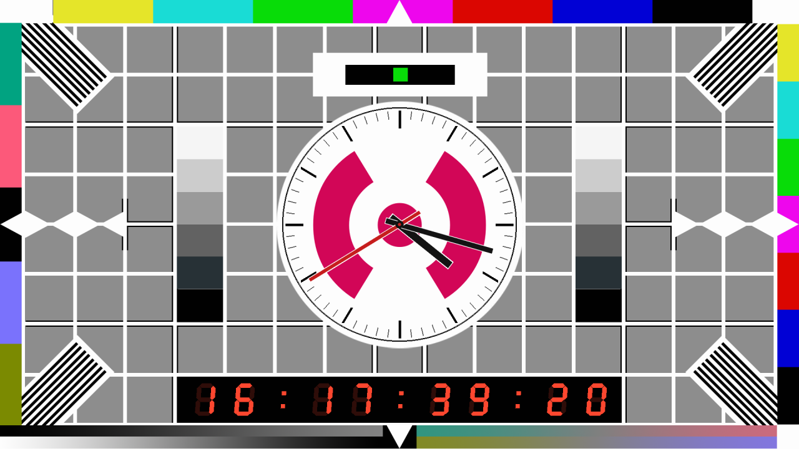

# piclock



*Straight off the Pi: `/dev/fb0` grabbed while the service was running.*

Fullscreen broadcast clock for a Raspberry Pi on HDMI, no desktop:

* a test card background at the native resolution: either drawn procedurally
  (`--card`: Philips **PM5544** or BBC **Test Card F**) or a ready-made image
  (`--card-image`, e.g. `cards/1080-mtv.png`);
* round analog clock — 60 tick marks, 12 major marks, dark hour/minute hands
  and a red second hand sweeping once per rendered frame — filling the circle
  in the middle of the card, transparent so a station logo shows through;
* time-of-day timecode `HH:MM:SS:FF` on a drawn seven-segment display — lit and
  unlit segments, leaning digits, square colon dots — stretched across the empty
  strip of the card below the clock, where `FF` advances every rendered frame at
  **the actual HDMI output rate**, detected at startup rather than hardcoded.

Everything static is rendered once into one background surface; each frame only
the hand bounding boxes and the timecode digits are repainted, which is what
keeps a 700 MHz ARM11 Pi 1 inside its frame budget at 1080p.

## Run

```bash
python3 -m piclock                              # on the Pi: fullscreen at the current HDMI mode
.venv/bin/python -m piclock --windowed --size 1280x720   # dev mode on a workstation
```

| flag | default | meaning |
|---|---|---|
| `--fps N` | auto | override the detected HDMI rate |
| `--size WxH` | native | force resolution (mode request or window size) |
| `--card NAME` | off | draw a card instead of the shipped image: `pm5544` or `bbc` |
| `--card-image PATH` | `cards/1080-mtv.png` | use another card image |
| `--windowed` | off | run in a window instead of fullscreen |
| `--frames N` | off | exit after N frames |
| `--dump-frames DIR` | off | save every frame as `frame_%04d.png` |
| `--log-tc` | off | print the timecode of every frame |
| `--stats` | off | print frame-time stats once a second |

### Cards

| `--card` | contents |
|---|---|
| `pm5544` | white 17 x 13 grid over grey, castellated border, greyscale staircase, 75 % EBU colour bars, five definition gratings, centre circle |
| `bbc` | Test Card F style: plain grey field, 95 % colour bars in descending luminance along the top, grey scale down the left of the circle, 1.5 – 5.25 MHz frequency-response gratings down the right, castellations with an overscan triangle at the middle of each edge, black-bar-on-white ringing patches flanking the ident box |

Test Card F's photograph of Carole Hersee and the clown is not reproduced; the
clock sits in the circle where it was.

### Ready-made card image

With no flags piclock uses `cards/1080-mtv.png`, resolved next to the package,
so a bare `python3 -m piclock` shows the station card from any working
directory. `--card-image PATH` picks another image; `--card NAME` opts out of
images entirely and draws one instead:

```bash
.venv/bin/python -m piclock --windowed                              # shipped station card
.venv/bin/python -m piclock --windowed --card-image cards/koekfm-1080.png
.venv/bin/python -m piclock --windowed --card pm5544                # drawn, no image
```

The card's own middle circle is measured at startup — 72 rays are cast from the
image centre until the flat field colour takes over, rays that never reach it
(white wedges running to the border) or that stop early inside a logo are
discarded, and the survivors give the centre and radius. The dial is scaled to
fill that circle and the timecode bar moves to just below it, so the clock sits
at the card's own size, not at the 17 x 13 grid's. If no circle stands out, the
drawn cards' geometry is kept.

The image is scaled once at startup, so its aspect ratio should match the
output mode. A missing or unreadable file exits with status 2 and
`piclock: cannot load card image …`.

`cards/koekfm-1080.png` is the same card with the other station logo. The
installer copies `cards/` to `/opt/piclock/cards/`, where the default resolves
to `/opt/piclock/cards/1080-mtv.png`. Drop other images there and point
`--card-image` at them.

The dial has no face of its own — nothing is painted under it, so a station
logo in the middle of the card shows through the clock. That is why the
markings are dark with a white contrast outline: they stay readable over a
logo, over grey, and over the gratings of a drawn card.

`Esc`, `q`, `SIGINT` and `SIGTERM` all stop the loop cleanly (exit code 0).

## Dev machine setup

pygame comes from apt on the Pi, so `python3 -m piclock` is the right command
there. On a workstation it is installed into a venv instead:

```bash
python3.11 -m venv .venv
.venv/bin/pip install "pygame>=2.5,<3"
.venv/bin/python -m piclock --windowed --size 1280x720
```

**This repo deliberately carries no `.tool-versions`.** If a version manager
(asdf, mise, pyenv) owns `python3`, a bare `python3 -m piclock` in this
directory fails before it reaches the code:

```
No version is set for command python3
Consider adding one of the following versions in your config file at .../.tool-versions
```

Pinning an interpreter there would not help: the shimmed interpreter is not the
one holding pygame, so it would trade that message for `ModuleNotFoundError:
No module named 'pygame'`. Call the venv interpreter by path — `.venv/bin/python`
— or `source .venv/bin/activate` first, which puts it ahead of the shim on
`PATH`. The systemd unit sidesteps the same class of problem by invoking
`/usr/bin/python3` absolutely.

## Install on the Pi

The deployed box is a **Raspberry Pi 1 Model B** (ARMv6, 181 MB RAM) running
**Raspbian jessie**, where the newest usable stack is **Python 3.4 + pygame
1.9.2 on SDL 1.2**. The whole package is written to that floor: no dataclasses,
no f-strings, no variable annotations, no SDL2-only calls. Keep it that way, or
the Pi stops booting the clock.

```bash
sudo bash deploy/install.sh
```

That installs `python3 python3-pygame fonts-dejavu-core rsync` (retrying
unauthenticated, because jessie's Release files have expired), copies the
package and `cards/` to `/opt/piclock`, installs
`/etc/systemd/system/piclock.service` and starts it. Check with
`systemctl status piclock`.

jessie's apt mirrors have moved: `/etc/apt/sources.list` must point at
`http://legacy.raspbian.org/raspbian/ jessie main contrib non-free rpi`, not at
`mirrordirector.raspbian.org`, which still serves indexes but 404s on every
`.deb`.

The unit takes over tty1: it `Conflicts=getty@tty1.service` (without that the
getty's vhangup kills the clock with SIGHUP), runs SDL on the framebuffer with
`SDL_VIDEODRIVER=fbcon`, and logs to the journal rather than to the console it
is drawing on.

### Manual system tweaks

1. **Boot to console, no desktop:** `sudo raspi-config nonint do_boot_behaviour B1`
2. **No console blanking:** append `consoleblank=0` to the kernel command line
   (`/boot/cmdline.txt` on jessie, `/boot/firmware/cmdline.txt` on bookworm), so
   nothing blanks the HDMI output.
3. **SDL2 targets only** (bookworm and newer): `dtoverlay=vc4-kms-v3d` in
   `config.txt` and `SDL_VIDEODRIVER=kmsdrm` in the unit instead of `fbcon`.

Also set the clock source, because both the dial and the timecode are local time
on a board without an RTC:

```bash
sudo timedatectl set-timezone Europe/Amsterdam
sudo timedatectl set-ntp true
```

## Notes

* Runs on pygame 1.9/SDL 1.2 (jessie) and pygame 2/SDL 2 (workstation venv).
  `vsync=1` is attempted and the `TypeError`/`pygame.error` from pygame 1.9 is
  caught; `pygame.display.get_current_refresh_rate` is probed with `getattr`.
  Fullscreen size comes from `pygame.display.Info()` because SDL 1.2 will not
  size a mode from `(0, 0)`.
* Rate detection order: `--fps`, then the pygame-ce refresh-rate API if present,
  then a 40-flip measurement snapped to the nearest standard rate, then 25.
  SDL 1.2 on the framebuffer does not sync flips to vblank, so on the Pi 1 the
  measurement reports the blit rate (~16 Hz at 1080p), nothing snaps, and the
  clock runs at the 25 fps fallback paced against the wall clock. Every rendered
  frame still gets its own `FF`.
* Measured on the Pi 1 at 1920×1080: **avg 23–24 ms, max 25 ms** per frame
  against a 40 ms budget. If a slower card or a busier dial pushes that over,
  add `--size 1280x720` to `ExecStart`. Do not reintroduce full-screen repaints
  or `pygame.transform.rotate`.
